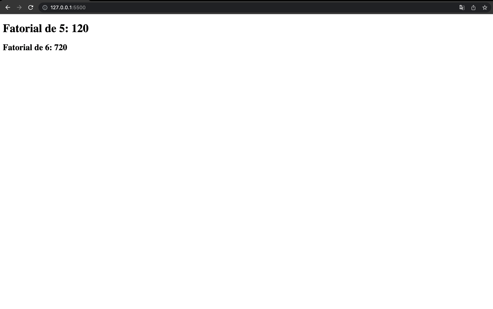

# Lua Webassembly

- Clone the repository

- If you want to, make a fresh install of the dependencies:

```shell
make clean

make install
```

- Serve the `index.html` file from a localhost server (I recommend the `live server` extension on `VS Code`)

- When your page opens, you should see the following result:
  
